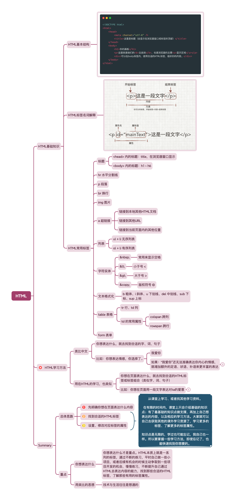
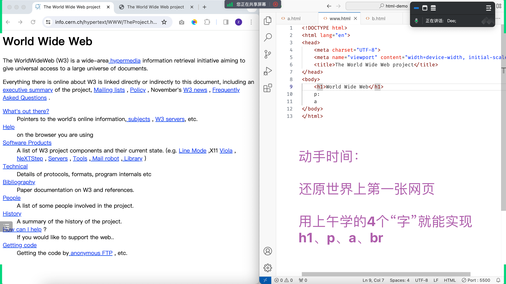
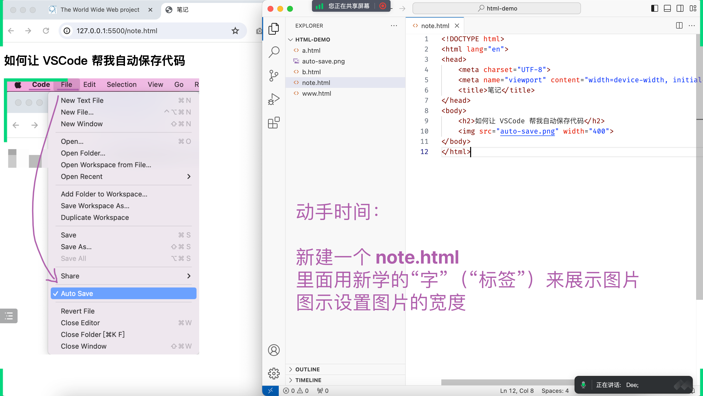
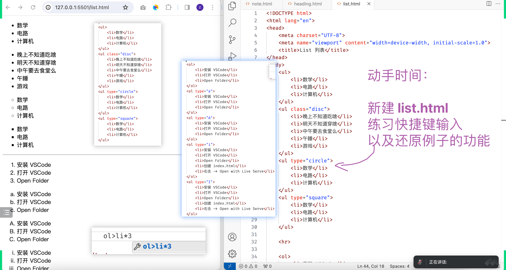
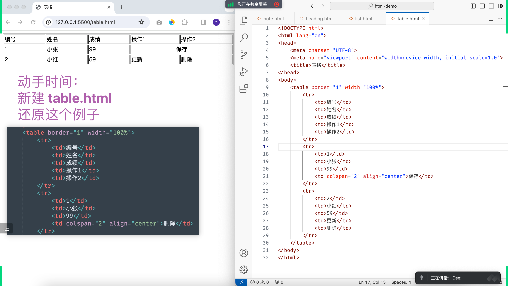
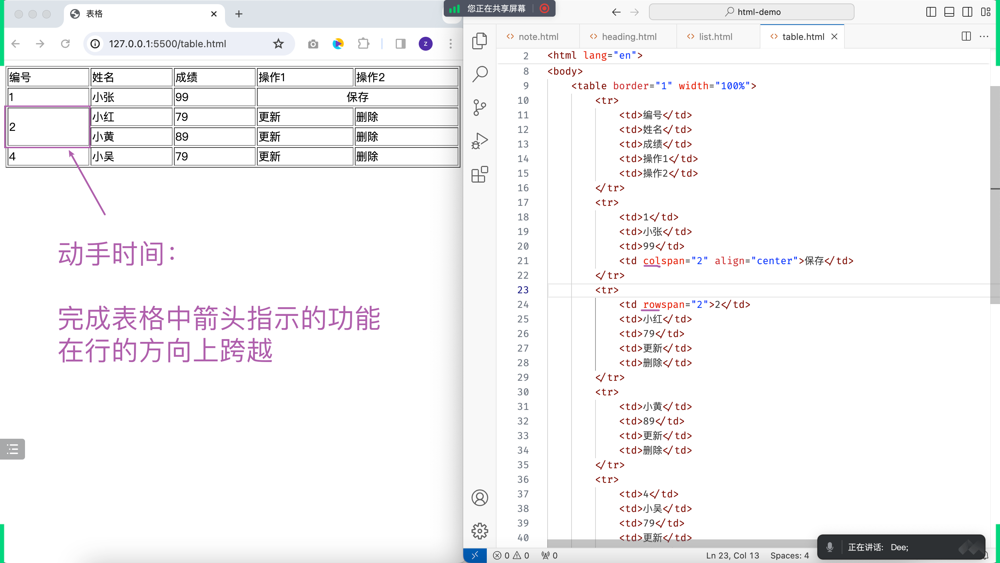
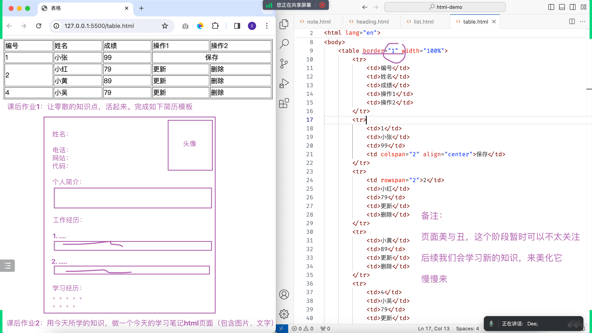
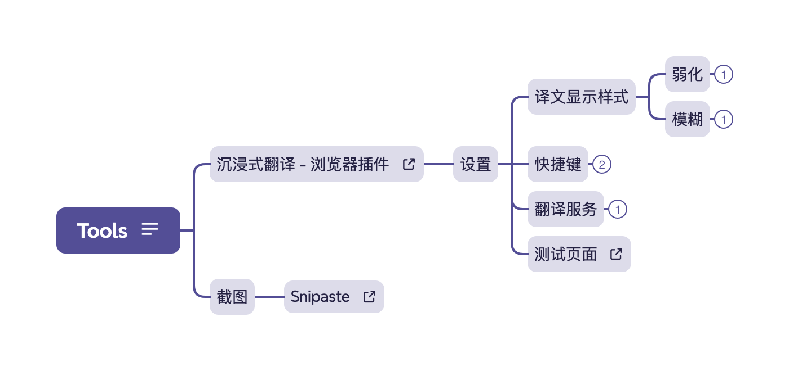

## 关于 Stage 0
- Stage 0，阶段 0
- 也可以叫预科阶段
- 正式课程开始的前一周

### Stage 0 的核心任务
- 对齐与共识
- 找回学习的感觉
- 介绍一些`简单`但`有用`的知识
- 为后续正式课程做准备、铺垫和衔接
- ...

## 对齐、共识
- 
- 
### 学习方法的共识
- 参考画画
  - 
- 先轮廓，再细节
  - 

### 独立思考能力的共识
- 敢于走自己的路。**前提：先有自己的思考**
  - 
- 但：并不是一味的去追求跟别人不一样，重点是要有自己的思考

### 思维提升的共识
- level of thinking
  - 
- 下面这张图是对上面👆爱因斯坦那句话的图片解释
  - 

### 一手资源的共识
- 明白一手资源的重要性
  - 

## 学习目的
- 为了找工作
- 为自己服务（别忘了你自己）

## 编程的本质
- 正好可以解释 `学习目的` 为什么不应该只有 `工作`
- 因为编程的本质就是解决问题
- 工作：是解决别人的问题
- 自己：肯定有自己的问题
- **所以，同样可以用学到的知识去解决自己的问题**！很多人都忘了这一点

## 

## 视野要打开
- 这个世界很大
- 不要只聚焦在`锅内`
- 看看外面的世界
- 这个世界也很小，因为有`互联网`

## 引出今天的主题之一：什么是 `Web`?
或者说：经常在浏览器地址栏输入的 www.baidu.com 的 `www` 是什么?
- World Wide Web
  - web
  - www
  - w3

### Web 历史回顾
在课堂上播放了几个短视频，简要回顾了 Web 历史
- 其实，它离我们很近，才 30 几年
- 而且，跟其他学科不一样，计算机学科的很多作者都还在世，感兴趣可以去关注它们的社交账号
- Web 的起初就是解决创始人自己的问题
- 很多牛逼的产品都是从解决`自己的问题`开始
- 所以，不要忽略自己，同时不要小看它的威力
- 动手做它，改进它，迭代它
- Web 三大核心技术
  - HTML
  - CSS
  - JavaScript

## HTML
- 类比学习法
- 你学习中文，不可能把整本字典都学完，才敢使用。学习 HTML 也一样
- 把 HTML 类比成 `普通话`。只要是语言，就至少会涉及到两方：讲的一方、听的一方
  - 对于 `HTML` 这门话也一样。讲的一方是我们，听的一方是浏览器（虽然不止浏览器）
  - 所以，我们在写 HTML 页面的时候，就是在对浏览器讲话，讲浏览器听得懂的话

### 还原世界上第一张网页
- HTML 作者在发明的时候就是想让所有人都能简单使用
- 所以，我们也不要把它学复杂了，或者说老师不应该把它教复杂了
- 简单学习了几个字（HTML标签）之后就可以开始做了

### 其他练习
- img
  - 
- list
  - 
- table
  - 
  - 

## 你可以做简历了
- 只要这些知识，你就可以做简历了
- 先忽略美化的问题，后续会用新知识再迭代
- 先轮廓，再细节。重要的是：`动起来！`

## 利器分享
- 这个世界已经变了，特别是最近一年的 AI 发展，几乎是以周为单位在改变
- 我们要善用利器，正所谓：`工欲善其事，必先利其器`

