## 课上看了 CSS 作者的分享
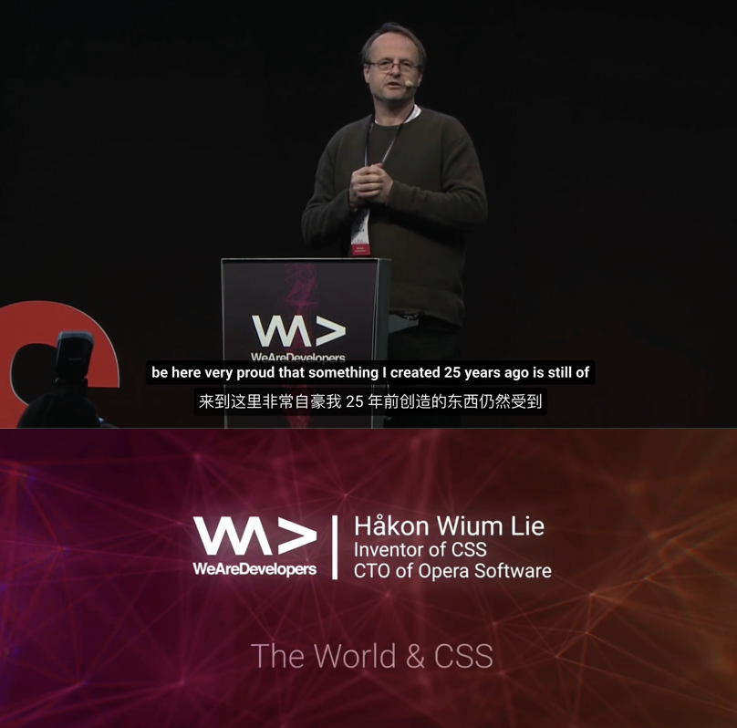

### 几个特意暂停的片段
- 科学家与机器
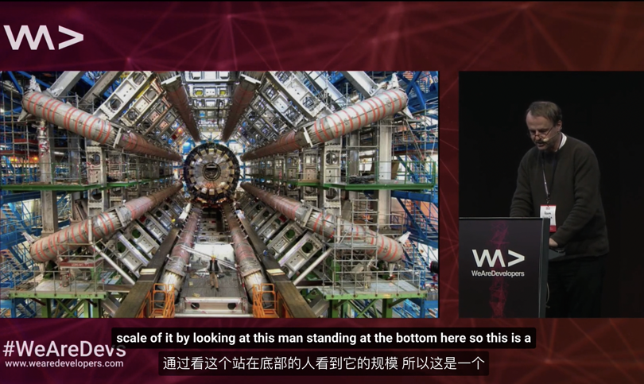
- you click, we do the rest!
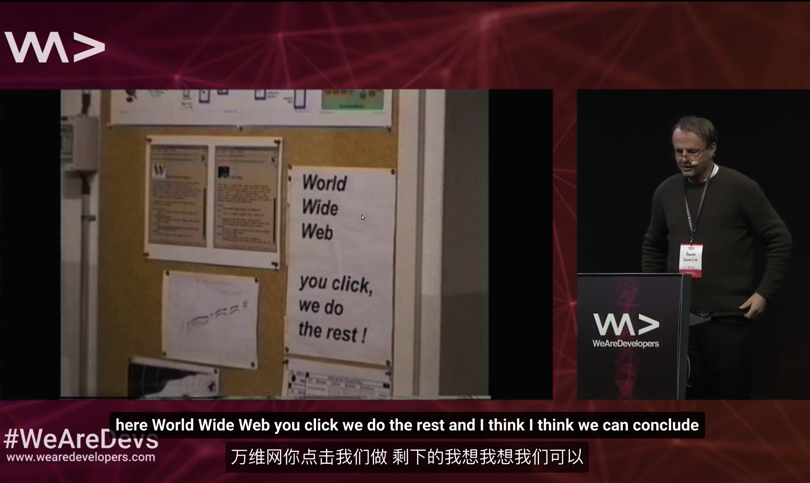
- 来自自然界的灵感
  - 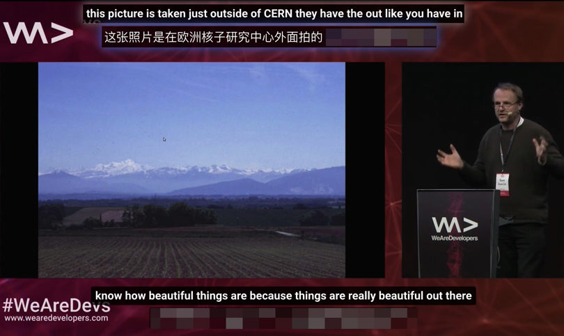
  - 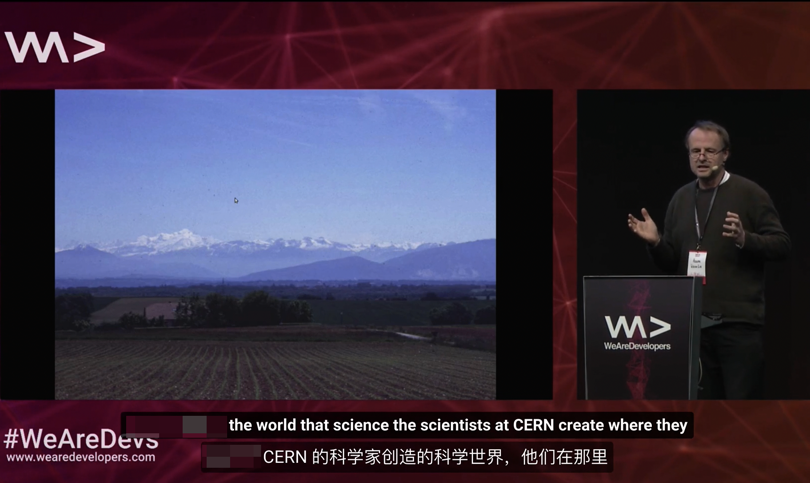
  - 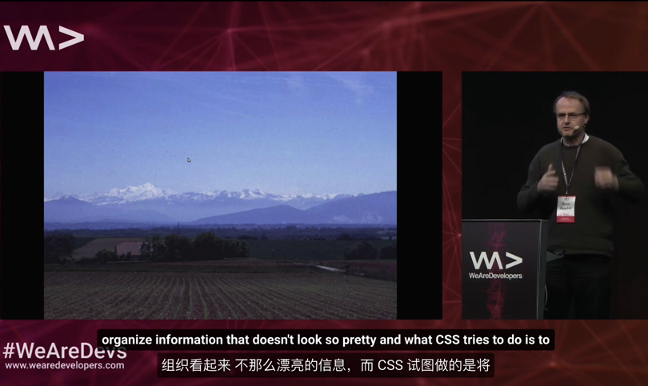
  - 
  - 
  - 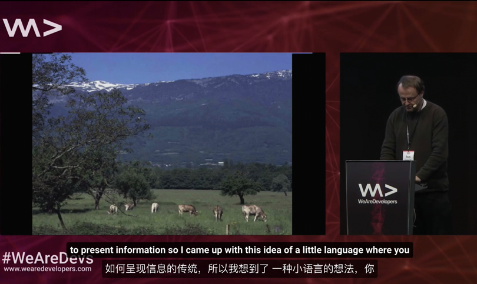
  - 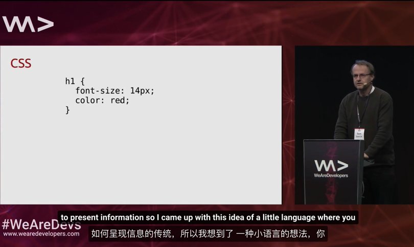
  - 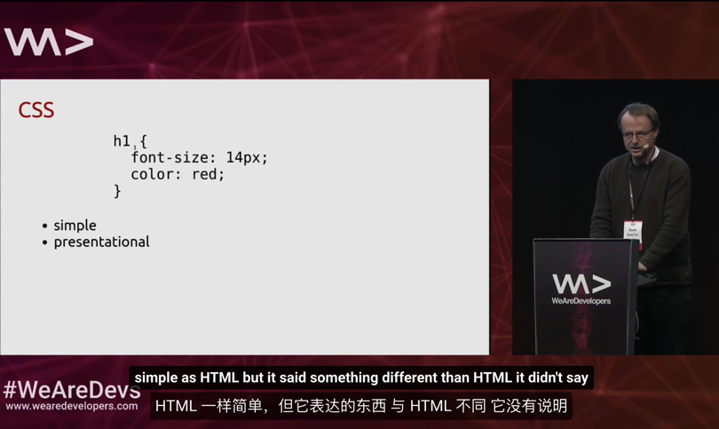

## Web 三大核心技术之二：CSS
CSS 作者在发明它的时候跟 HTML 类似，想让所有人都能简单使用它
- 所以，跟学习 HTML 的时候要强调的一样：`不能把它学复杂了，不能把它教复杂了`

## CSS 学习口诀
> 找到它，改变它
> -- -- --
> 找谁 {
> 
>     改变什么;
> 
> }

## 基础语法
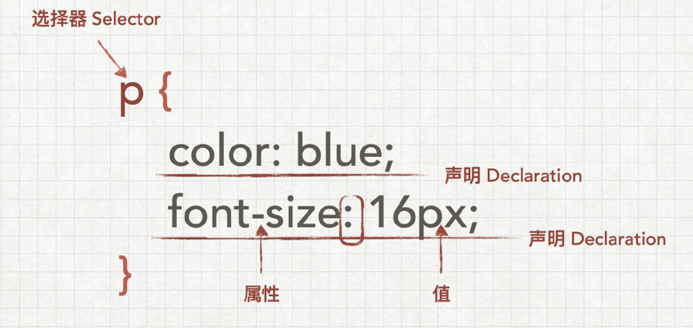

## 选择器（找谁？）
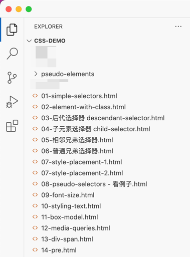

## 部分课上练习
- 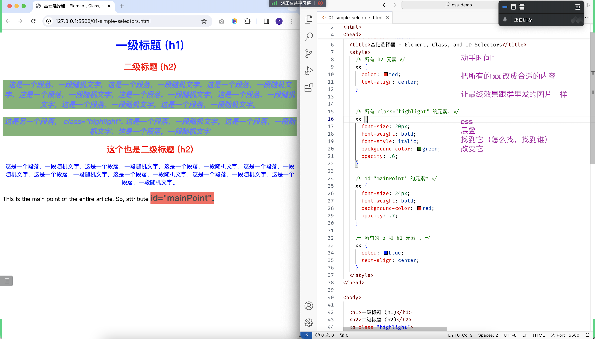
- 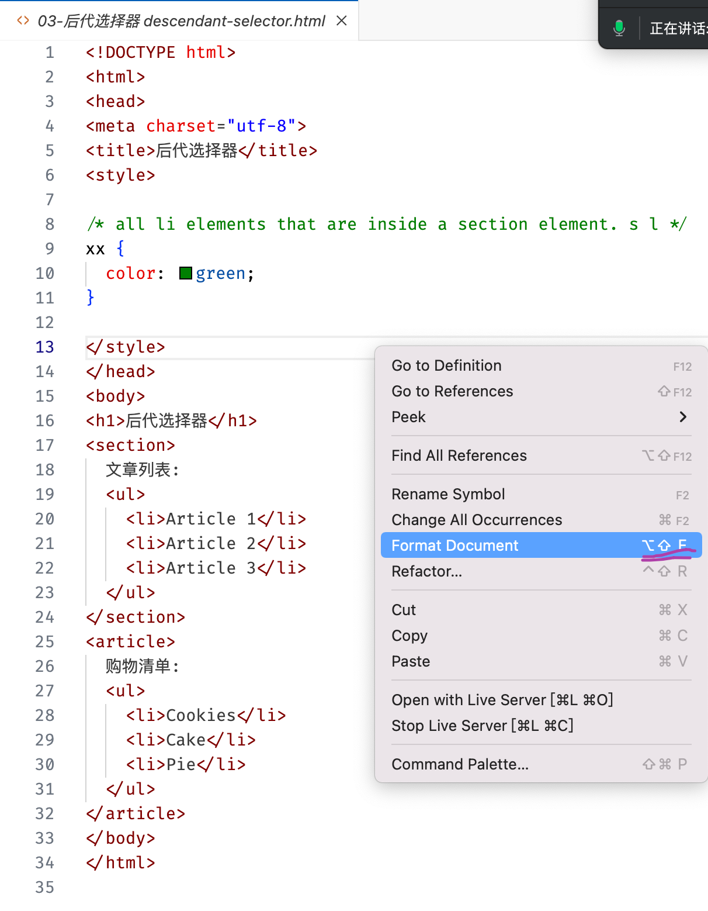
- 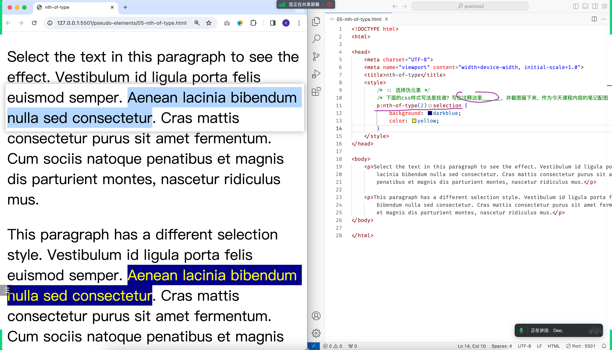
- 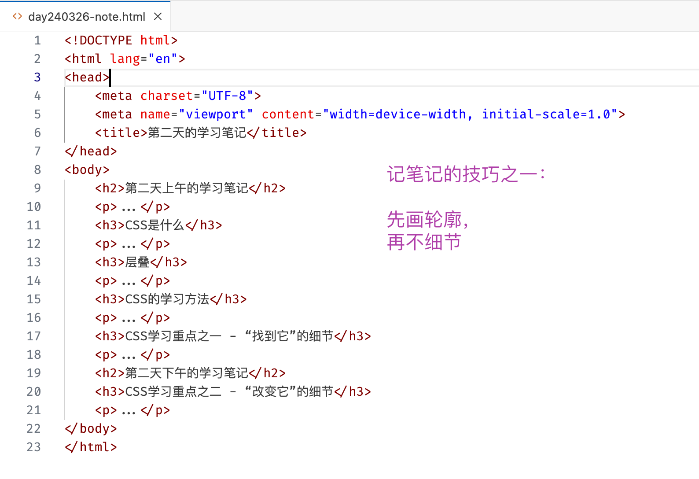
- 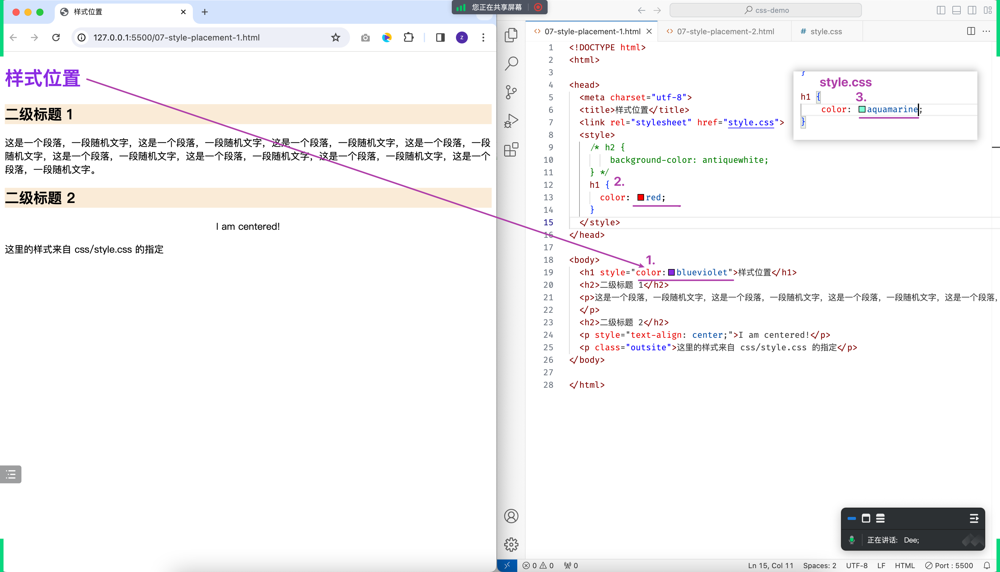
- 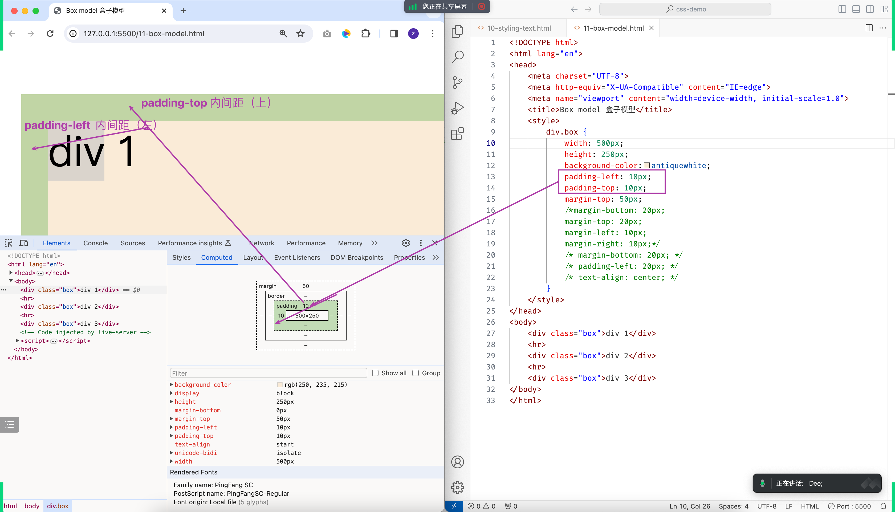
- 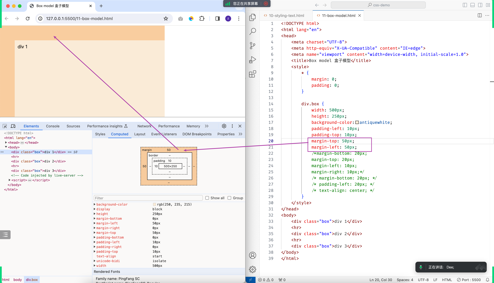
- 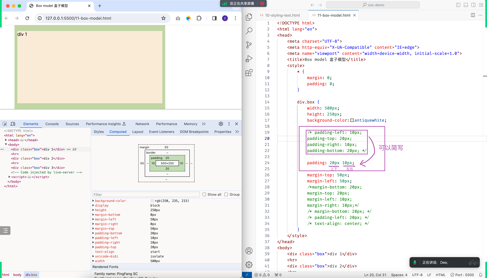

## 改变它
通过以下例子学习常见的 CSS 样式规则
- 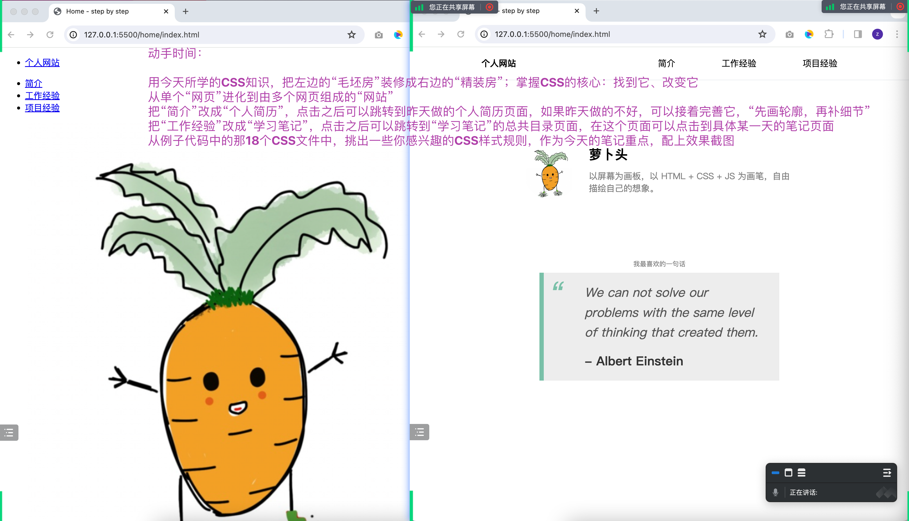
