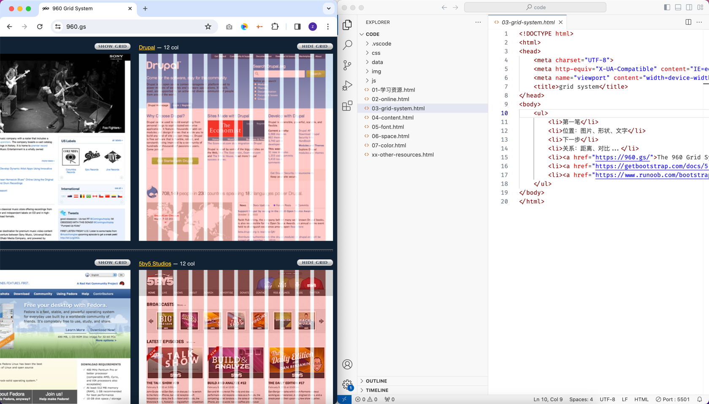
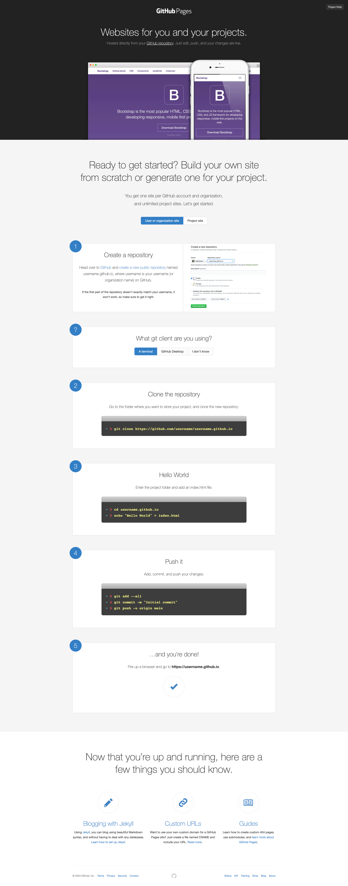

## 非技术之`设计`基础

## 注册 GitHub
- 发现基地教室的网络能访问 GitHub
- 每个人都注册 GitHub 账号

## GihHub Pages
**今天的重点**
- 借助它，获得子域名
- 上线自己的`个人简历`和`个人网站`

**对外公开，能倒逼自己更认真对待**

## Git
学习 Git 的最最基础的功能
- 基础配置
- 版本控制
- push 到 GitHub 远程仓库

Git 命令要复杂起来也可以很复杂，暂时先学习最基础，慢慢补充